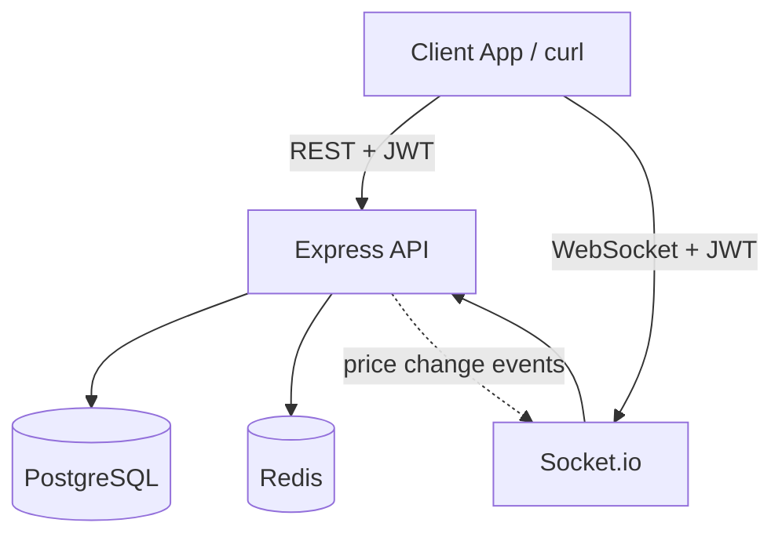
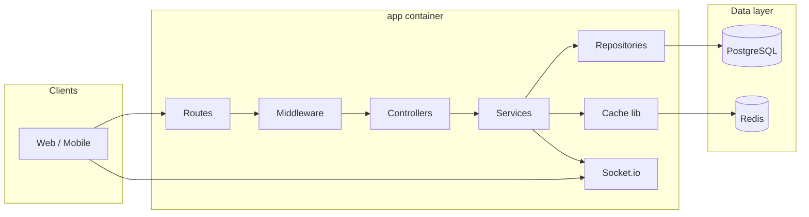
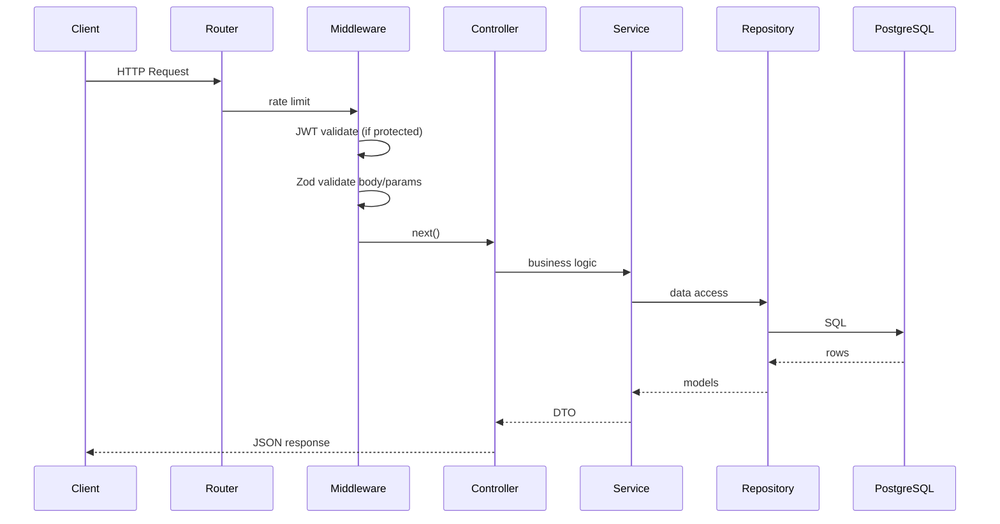
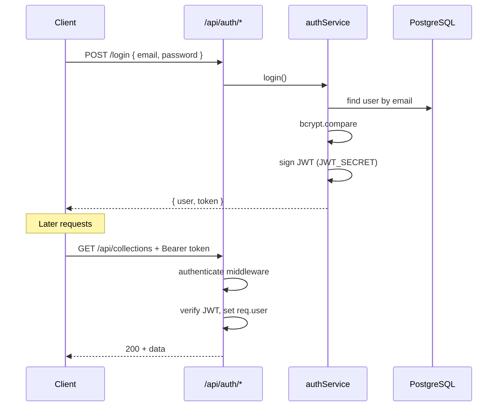
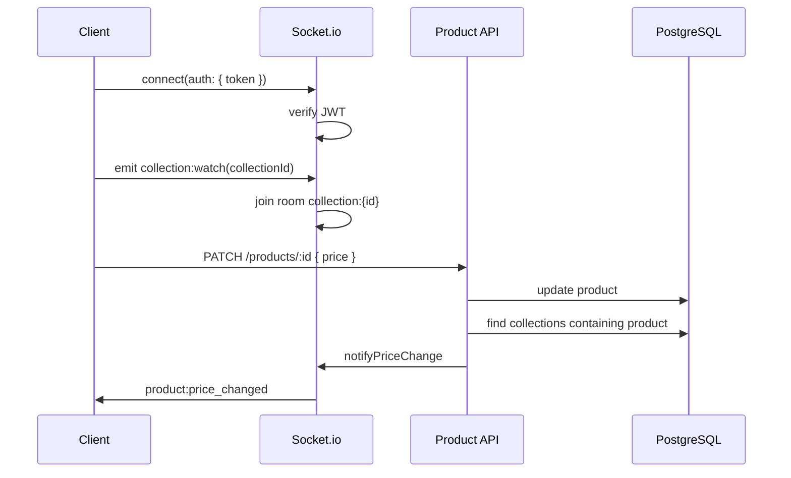
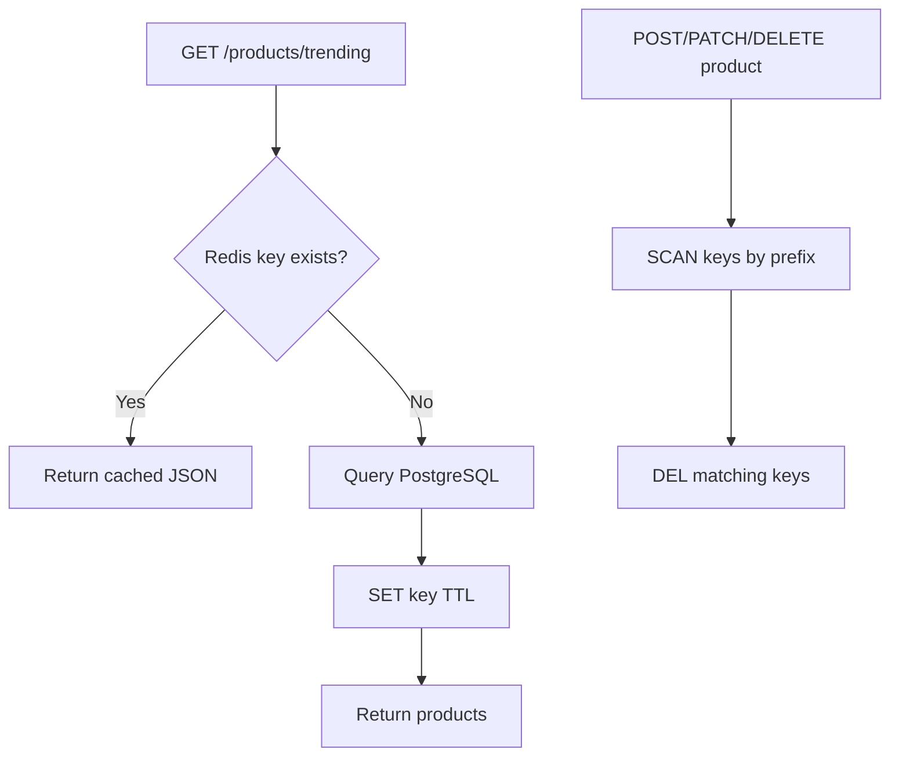
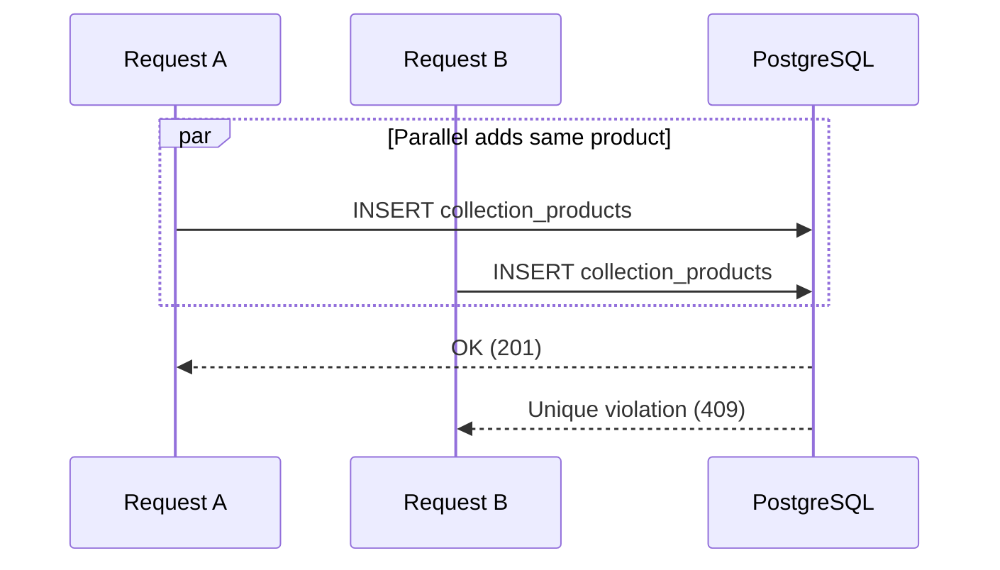
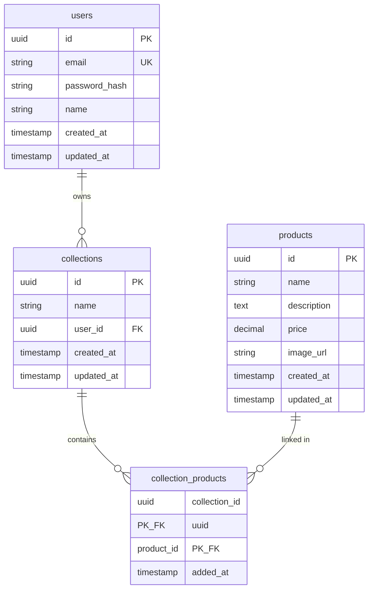

# Trove API

A production-oriented backend for a **product discovery platform** (similar to Trove). Users authenticate, curate **collections** of products, browse trending items, and receive **real-time price alerts** when a product in a watched collection changes price.

This document is written for engineers onboarding to the project without prior context. It explains **what** the system does, **how** it is built, and **why** key decisions were made.

---

## Table of Contents

1. [Project Overview](#1-project-overview)
2. [Architecture](#2-architecture)
3. [System Flows](#3-system-flows)
4. [Diagrams (Mermaid)](#4-diagrams-mermaid)
5. [API Reference](#5-api-reference)
6. [Database](#6-database)
7. [Concurrency & Scalability](#7-concurrency--scalability)
8. [Project Structure](#8-project-structure)
9. [Environment Variables](#9-environment-variables)
10. [Local Development Guide](#10-local-development-guide)
11. [Production Considerations](#11-production-considerations)
12. [Engineering Decisions](#12-engineering-decisions)

---

## 1. Project Overview

### Purpose

Trove API powers a backend where users:

- Discover and manage **products** (name, price, description, image).
- Organize products into personal **collections** (wishlists, gift lists, etc.).
- See **trending** products quickly via Redis caching.
- Get **live notifications** when a product price changes in a collection they are watching.

### Business Problem

Product discovery apps need:

1. **Persistent curation** — users save products into collections over time.
2. **Fast browsing** — trending/high-value products must load quickly under traffic.
3. **Timely updates** — price drops or increases should reach interested users immediately without polling.

This API solves those needs with a REST layer for CRUD operations, Redis for hot reads, and Socket.io for push updates.

### Core Features

| Feature | Description |
|--------|-------------|
| **JWT authentication** | Register/login; all other routes require a bearer token |
| **User CRUD** | Manage user profiles |
| **Collection CRUD** | Create lists owned by a user |
| **Collection ↔ Product M2M** | Add/remove products; duplicates blocked per collection |
| **Product CRUD** | Full product lifecycle; price updates trigger WebSocket events |
| **Trending cache** | Redis cache-aside for `GET /products/trending` |
| **Real-time prices** | Socket.io room per collection; `product:price_changed` event |
| **Safe concurrency** | DB composite key prevents duplicate collection products |
| **Docker Compose** | One command starts app + Postgres + Redis |

---

## 2. Architecture

### High-Level Overview

The system is a **modular monolith**: one Node.js process exposes HTTP + WebSocket, talks to PostgreSQL for durable data, and Redis for ephemeral cache.



### Why These Technologies?

| Technology | Role | Why |
|------------|------|-----|
| **Node.js + TypeScript** | Runtime & types | Fast iteration, strong typing for API contracts |
| **Express** | HTTP server | Minimal, well-known, easy to structure in layers |
| **Sequelize** | ORM | Explicit models, associations, PostgreSQL support |
| **PostgreSQL** | Primary database | ACID, constraints, relational data (users, collections, M2M) |
| **Redis** | Cache | Sub-millisecond reads for trending products |
| **Socket.io** | WebSockets | Room-based broadcasts, browser-friendly fallbacks |
| **JWT** | Auth | Stateless API auth; same token used for Socket.io handshake |
| **Docker Compose** | Local/prototype deploy | Reproducible multi-service stack in one command |
| **Zod** | Validation | Runtime request validation with clear errors |

### How Services Communicate

1. **Client → Express**: JSON over HTTP. Protected routes send `Authorization: Bearer <JWT>`.
2. **Express → PostgreSQL**: Sequelize repositories run queries/transactions.
3. **Express → Redis**: Cache layer on read; invalidation on product writes.
4. **Client → Socket.io**: Connect with `auth: { token }`. Join rooms via `collection:watch`.
5. **Express → Socket.io**: On product price `PATCH`, service looks up affected collections and emits to rooms.

### Component Responsibilities

#### Express API
- Route HTTP requests to controllers
- Validate input (Zod)
- Enforce authentication
- Apply rate limiting
- Return consistent JSON errors

#### PostgreSQL
- Source of truth for users, products, collections, and links
- Enforces referential integrity and uniqueness (including duplicate product prevention)

#### Redis
- Stores serialized trending product lists
- TTL-based expiry (`CACHE_TRENDING_TTL_SECONDS`)
- Invalidated on product create/update/delete

#### Socket.io
- Authenticates connections with JWT
- Room per collection (`{SOCKET_ROOM_PREFIX}{collectionId}`)
- Pushes `product:price_changed` to watchers

#### JWT Middleware
- Parses `Authorization` header
- Verifies signature and expiry via `JWT_SECRET`
- Attaches `{ sub, email }` to `req.user`
- Returns `401` for missing/invalid tokens

---

## 3. System Flows

### 3.1 User Authentication

1. Client sends `POST /api/auth/register` or `POST /api/auth/login` with credentials.
2. **Auth service** hashes password with `bcrypt` (`BCRYPT_ROUNDS` from env).
3. On login, password is compared to stored hash.
4. **JWT** is signed with `JWT_SECRET` and `JWT_EXPIRES_IN`.
5. Client stores token and sends it on subsequent requests.

### 3.2 Creating a Collection

1. Client calls `POST /api/collections` with `{ "name": "..." }` and JWT.
2. **Auth middleware** validates token → `req.user.sub` is the owner `userId`.
3. **Collection service** creates row in `collections`.
4. Response returns collection metadata (empty `products` array).

### 3.3 Adding Products to a Collection

1. Client calls `POST /api/collections/:id/products` with `{ "productId": "uuid" }`.
2. Service verifies collection exists and belongs to the user.
3. **Repository** runs a transaction:
   - Confirms product exists
   - Inserts into `collection_products`
4. If the product is already in the collection, PostgreSQL rejects the insert (composite PK) → **409 Conflict**.
5. Response includes link metadata and serialized product.

### 3.4 Real-Time Price Update Notifications

1. Client watches a collection: Socket `collection:watch` with `collectionId`.
2. Server joins socket to room `collection:{id}`.
3. Another client (or same) calls `PATCH /api/products/:id` with new `price`.
4. **Product service** detects price change, finds all `collection_id`s containing that product.
5. **Socket.io** emits `product:price_changed` to each room with payload:
   - `collectionId`, `productId`, `name`, `previousPrice`, `newPrice`, `changedAt`

### 3.5 Redis Caching Flow (Cache-Aside)

1. `GET /api/products/trending?limit=N` hits **product service**.
2. Cache key: `{CACHE_TRENDING_KEY_PREFIX}:{limit}`.
3. **Cache hit** → return JSON from Redis.
4. **Cache miss** → query PostgreSQL (`ORDER BY price DESC`), store in Redis with TTL, return.
5. On product **create/update/delete** → delete all keys matching prefix (SCAN + DEL).

### 3.6 Concurrent Product Additions

1. Two requests add the same `productId` to the same `collectionId` simultaneously.
2. Both pass application checks; both attempt `INSERT` into `collection_products`.
3. PostgreSQL allows only one row for `(collection_id, product_id)` (composite primary key).
4. Winner: `201 Created`. Loser: `UniqueConstraintError` → **409** `"Product already in collection"`.
5. **Why reliable**: the database constraint is atomic; no race can create two rows.

---

## 4. Diagrams (Mermaid)

### 4.1 Overall Architecture



### 4.2 Request Lifecycle



### 4.3 Authentication Flow



### 4.4 WebSocket Communication



### 4.5 Redis Cache Flow



### 4.6 Product Addition Concurrency



### 4.7 Database Relationships (ER)



---

## 5. API Reference

**Base URL:** `http://{APP_HOST}:{PORT}{API_PREFIX}` (default `http://localhost:3000/api`)

**Authentication:** Unless noted, send:

```http
Authorization: Bearer <JWT>
```

### Auth (public)

#### `POST /api/auth/register`

| | |
|--|--|
| **Body** | `{ "email": "string", "password": "string (min 8)", "name": "string" }` |
| **Success** | `201` — `{ "user": { id, email, name }, "token": "..." }` |
| **Errors** | `409` email exists, `400` validation |

#### `POST /api/auth/login`

| | |
|--|--|
| **Body** | `{ "email": "string", "password": "string" }` |
| **Success** | `200` — `{ "user", "token" }` |
| **Errors** | `401` invalid credentials |

### Users (protected)

| Method | Path | Description |
|--------|------|-------------|
| `GET` | `/api/users/me` | Current user from JWT |
| `GET` | `/api/users` | List all users |
| `GET` | `/api/users/:id` | Get user by ID |
| `PATCH` | `/api/users/:id` | `{ "name"?, "email"? }` |
| `DELETE` | `/api/users/:id` | Delete user |

**Response shape:** `{ "data": { id, email, name, createdAt, updatedAt } }`

### Products (protected)

| Method | Path | Description |
|--------|------|-------------|
| `GET` | `/api/products/trending?limit=10` | Cached trending (1–50) |
| `GET` | `/api/products` | List all |
| `POST` | `/api/products` | Create product |
| `GET` | `/api/products/:id` | Get one |
| `PATCH` | `/api/products/:id` | Update (price change → WebSocket) |
| `DELETE` | `/api/products/:id` | Delete |

**Create body:**

```json
{
  "name": "Wireless Headphones",
  "description": "Optional",
  "price": 199.99,
  "imageUrl": "https://example.com/img.jpg"
}
```

**Product response:** `{ "data": { id, name, description, price, imageUrl, createdAt, updatedAt } }`  
(`price` is a number in JSON)

### Collections (protected)

| Method | Path | Description |
|--------|------|-------------|
| `POST` | `/api/collections` | `{ "name": "Wishlist" }` |
| `GET` | `/api/collections` | List current user's collections with products |
| `GET` | `/api/collections/:id` | One collection + products |
| `PATCH` | `/api/collections/:id` | `{ "name": "..." }` |
| `DELETE` | `/api/collections/:id` | Delete |
| `POST` | `/api/collections/:id/products` | `{ "productId": "uuid" }` |
| `DELETE` | `/api/collections/:id/products/:productId` | Remove link |

**Collection with products:**

```json
{
  "data": {
    "id": "uuid",
    "name": "Wishlist",
    "userId": "uuid",
    "products": [
      {
        "addedAt": "2025-05-15T12:00:00.000Z",
        "id": "uuid",
        "name": "Product",
        "price": 99.99
      }
    ]
  }
}
```

### Health & Docs

| Method | Path | Auth |
|--------|------|------|
| `GET` | `/health` | No |
| `GET` | `/api/docs` | No (Swagger UI) |

### Error Format

```json
{
  "error": {
    "message": "Human-readable message",
    "code": "ERROR_CODE"
  }
}
```

| Status | Typical `code` | When |
|--------|----------------|------|
| `400` | `VALIDATION_ERROR` | Zod validation failed |
| `401` | `UNAUTHORIZED` | Missing/invalid JWT |
| `403` | `FORBIDDEN` | Not collection owner |
| `404` | `NOT_FOUND` | Resource missing |
| `409` | `DUPLICATE_PRODUCT` / `DUPLICATE_ENTRY` | Duplicate email or collection product |
| `429` | `RATE_LIMITED` | Too many requests |
| `500` | `INTERNAL_ERROR` | Unexpected server error |

---

## 6. Database

### Tables

| Table | Purpose |
|-------|---------|
| `users` | Accounts (email unique, bcrypt password hash) |
| `products` | Catalog items with `price` as `DECIMAL(12,2)` |
| `collections` | Named lists owned by a user (`user_id` FK, cascade delete) |
| `collection_products` | Join table: which products are in which collections |

### Relationships

- **User 1:N Collections** — each collection has exactly one owner.
- **Collection M:N Products** — via `collection_products`.
- Deleting a user cascades to collections and their links.
- Deleting a product cascades its collection links.

### Constraints

| Constraint | Table | Purpose |
|------------|-------|---------|
| `PRIMARY KEY (id)` | users, products, collections | Identity |
| `UNIQUE (email)` | users | One account per email |
| `PRIMARY KEY (collection_id, product_id)` | collection_products | **Prevents duplicate products in same collection** |
| `FOREIGN KEY` + `ON DELETE CASCADE` | collections, collection_products | Referential integrity |

### Why Many-to-Many?

A **product** can appear in many users' collections, and a **collection** contains many products. A join table is the normalized relational pattern—no duplicated product rows, no array columns in PostgreSQL.

### Indexing Strategy

| Index | Column(s) | Why |
|-------|-----------|-----|
| Unique | `users.email` | Fast login lookup, uniqueness |
| B-tree | `collections.user_id` | List collections by owner |
| B-tree | `products.price` | Trending sort `ORDER BY price DESC` |
| B-tree | `collection_products.product_id` | Find collections when price changes (WebSocket fan-out) |
| Composite PK | `(collection_id, product_id)` | Uniqueness + efficient link lookup |

---

## 7. Concurrency & Scalability

### Duplicate Product Prevention

- **Mechanism**: composite primary key on `collection_products (collection_id, product_id)`.
- **Application**: catch `SequelizeUniqueConstraintError` → HTTP 409.
- **Why not app-only checks**: two concurrent requests can both pass a `SELECT` existence check; only the database serializes writes correctly.

### Transactions

`addProduct` uses a Sequelize transaction to verify the product exists before insert. The uniqueness guarantee still comes from the DB constraint.

### Redis Performance

- Trending endpoint is read-heavy; cache-aside avoids repeated `ORDER BY price` queries.
- TTL (`CACHE_TRENDING_TTL_SECONDS`) bounds staleness.
- Writes invalidate cache so users do not see stale trending lists indefinitely.

### Socket.io Scaling (Conceptual)

- Current setup: single Node process, in-memory rooms.
- **Horizontal scale**: use `@socket.io/redis-adapter` so multiple app instances share room membership; sticky sessions or same adapter required.
- Clients still authenticate per connection with JWT.

---

## 8. Project Structure

```
src/
├── config/           # Zod-validated env (single source of truth)
├── controllers/      # HTTP: parse request, call service, set status code
├── services/         # Business rules, orchestration, cache, WS triggers
├── repositories/     # Sequelize queries only — no HTTP knowledge
├── models/           # Sequelize model definitions + associations
├── database/         # sequelize connection, migrate (sync), seed
├── routes/           # Express routers + middleware chains
├── middleware/       # auth, validation, errors, rate limit, async wrapper
├── validators/       # Zod schemas per resource
├── lib/              # redis client, cache helpers, logger
├── socket/           # Socket.io server, rooms, price events
├── errors/           # AppError hierarchy
├── utils/            # jwt, serialize, route param helper
├── docs/             # Swagger spec
└── index.ts          # Process entry → startServer()
```

| Folder | Responsibility |
|--------|----------------|
| **controllers** | Thin HTTP adapter; no business logic |
| **services** | Rules: ownership, caching, notifications |
| **repositories** | SQL/ORM access patterns |
| **middleware** | Cross-cutting: auth, validation, errors |
| **socket** | Real-time layer, JWT on handshake |
| **lib/cache** | Cache-aside get/set/invalidate |
| **config** | All tunables from environment |
| **routes** | Wire URLs → middleware → controllers |
| **utils** | Shared pure helpers |

---

## 9. Environment Variables

### Setup (required before first run)

Secrets are **never** documented in this README. They live only in your local `.env` (gitignored).

```bash
cp .env.example .env
# Open .env and replace every value that starts with CHANGE_ME_
```

Generate a JWT secret (example):

```bash
openssl rand -hex 32
```

Validate locally before Docker:

```bash
set -a && source .env && set +a && npm run env:validate
```

On `docker compose up`, the entrypoint runs `scripts/validate-env.sh` and **exits with an error** if any `CHANGE_ME_*` placeholder is still present.

**Nothing is hardcoded in application code** — credentials, seed data, JWT, Redis/Postgres hosts, cache TTL, rate limits, and Socket.io settings all come from env.

### Required (always)

| Variable | Description |
|----------|-------------|
| `JWT_SECRET` | Min 16 characters; signs and verifies tokens |

### Application

| Variable | Default | Description |
|----------|---------|-------------|
| `NODE_ENV` | `development` | `development` \| `production` \| `test` |
| `PORT` | `3000` | HTTP port |
| `APP_HOST` | `localhost` | Hostname for docs/examples |
| `API_PREFIX` | `/api` | REST mount path |

### PostgreSQL

Either set `DATABASE_URL` **or** individual parts (app builds the URL):

| Variable | Notes |
|----------|-------|
| `POSTGRES_HOST` | `postgres` inside Docker; `localhost` when running app on host |
| `POSTGRES_PORT` | Default `5432` |
| `POSTGRES_USER` | **Required** — set in `.env` |
| `POSTGRES_PASSWORD` | **Required** — set in `.env` (never commit) |
| `POSTGRES_DB` | **Required** — set in `.env` |
| `POSTGRES_SCHEMA` | Default `public` |

Docker Compose reads `.env` from the project root via `env_file` (values are injected, not baked into the image).

### Redis

| Variable | Default |
|----------|---------|
| `REDIS_HOST` | `localhost` |
| `REDIS_PORT` | `6379` |
| `REDIS_URL` | *(optional override)* |

### Auth & Security

| Variable | Default |
|----------|---------|
| `JWT_EXPIRES_IN` | `7d` |
| `BCRYPT_ROUNDS` | `10` |

### Cache & Rate Limit

| Variable | Default |
|----------|---------|
| `CACHE_TRENDING_TTL_SECONDS` | `300` |
| `CACHE_TRENDING_KEY_PREFIX` | `products:trending` |
| `RATE_LIMIT_WINDOW_MS` | `60000` |
| `RATE_LIMIT_MAX` | `100` |

### Socket.io

| Variable | Default |
|----------|---------|
| `SOCKET_CORS_ORIGIN` | `*` (comma-separated for multiple origins) |
| `SOCKET_PATH` | `/socket.io` |
| `SOCKET_ROOM_PREFIX` | `collection:` |

### Seed (required when `RUN_SEED=true`)

| Variable | Description |
|----------|-------------|
| `RUN_SEED` | `true` / `false` — run seed on container start |
| `SEED_USER_EMAIL` | Initial user email (your choice; stored only in `.env`) |
| `SEED_USER_PASSWORD` | Initial user password (min 8 chars; hashed before storage) |
| `SEED_USER_NAME` | Display name for seeded user |
| `SEED_COLLECTION_NAME` | Name of the first collection |
| `SEED_PRODUCTS_JSON` | JSON array: `[{ "name", "price", "description?", "imageUrl?" }]` |

See `.env.example` for the full list of keys and placeholder format (`CHANGE_ME_*`).

---

## 10. Local Development Guide

### Prerequisites

- Docker & Docker Compose
- (Optional) Node.js 22+ for running outside Docker

### Step 1 — Configure environment

```bash
cp .env.example .env
```

Edit `.env` and replace **every** `CHANGE_ME_*` value (database credentials, `JWT_SECRET`, seed user fields).  
Do not commit `.env`.

Optional check:

```bash
set -a && source .env && set +a && npm run env:validate
```

### Step 2 — Start the stack

```bash
docker compose up --build
```

This will:

1. **Validate env** — fail fast if placeholders remain (`scripts/validate-env.sh`)
2. Start PostgreSQL and Redis (healthchecks)
3. Wait for both (entrypoint script)
4. Sync schema (`npm run db:migrate`)
5. Seed if `RUN_SEED=true` (using your `SEED_*` values only)
6. Start the app with hot reload (`tsx watch`)

### Step 3 — Verify health

```bash
curl http://localhost:3000/health
# {"status":"ok","postgres":"ok","redis":"ok"}
```

### Step 4 — Authenticate

Load credentials from `.env` into your shell (values stay on your machine):

```bash
set -a && source .env && set +a

export API="http://localhost:${PORT}/api"

export TOKEN=$(curl -s -X POST "$API/auth/login" \
  -H "Content-Type: application/json" \
  -d "{\"email\":\"${SEED_USER_EMAIL}\",\"password\":\"${SEED_USER_PASSWORD}\"}" | jq -r .token)

test -n "$TOKEN" && echo "Login OK"
```

### Step 5 — Call protected endpoints

```bash
curl -s "$API/collections" -H "Authorization: Bearer $TOKEN" | jq
curl -s "$API/products/trending?limit=5" -H "Authorization: Bearer $TOKEN" | jq
```

### Step 6 — WebSocket test

```javascript
import { io } from 'socket.io-client';

const token = '<JWT from login>';
const socket = io('http://localhost:3000', {
  path: process.env.SOCKET_PATH || '/socket.io',
  auth: { token },
});

socket.on('connect', () => {
  socket.emit('collection:watch', '<collection-uuid>');
});

socket.on('product:price_changed', console.log);
```

Then update a product price:

```bash
curl -X PATCH "$API/products/<product-id>" \
  -H "Authorization: Bearer $TOKEN" \
  -H "Content-Type: application/json" \
  -d '{"price": 149.99}'
```

### Common Troubleshooting

| Issue | Fix |
|-------|-----|
| `CHANGE_ME_* placeholder` on start | Edit `.env` and replace all placeholders; run `npm run env:validate` |
| `Invalid environment variables` on start | Ensure `.env` exists; if `RUN_SEED=true`, all `SEED_*` vars must be set |
| `JWT_SECRET` too short | Use at least 16 characters (e.g. `openssl rand -hex 32`) |
| Cannot connect to Postgres | Check `POSTGRES_HOST` is `postgres` inside Docker, `localhost` on host |
| Redis degraded on `/health` | Wait for Redis healthcheck; verify `REDIS_HOST` |
| 401 on all routes | Token expired or missing `Bearer ` prefix |
| 409 adding product | Product already in collection (expected) |
| Docker daemon not running | Start Docker Desktop / daemon |

### Scripts (without Docker)

```bash
cp .env.example .env   # then replace CHANGE_ME_* values
set -a && source .env && set +a
npm install
npm run env:validate
npm run db:migrate
npm run db:seed          # only if RUN_SEED=true in .env
npm run dev
npm test
npm run lint
```

---

## 11. Production Considerations

### Scaling

- **Stateless API** instances behind a load balancer (JWT = no server session).
- **PostgreSQL**: read replicas for heavy read workloads; connection pooling (PgBouncer).
- **Redis**: managed Redis cluster for cache; Socket.io Redis adapter for multi-instance WS.
- **Workers**: move heavy jobs (email, analytics) off request path if added later.

### Security

- Rotate `JWT_SECRET`; use strong unique `POSTGRES_PASSWORD`.
- Set `SOCKET_CORS_ORIGIN` to real front-end origins (not `*`).
- Terminate TLS at reverse proxy (nginx, ALB).
- Never commit `.env`; use secrets manager in production.
- Keep `BCRYPT_ROUNDS` at 10–12 (balance security vs CPU).

### Rate Limiting

Configured via `RATE_LIMIT_WINDOW_MS` and `RATE_LIMIT_MAX` on all `/api` routes.

### Monitoring

- Structured logs via **Pino** (`LOG_LEVEL`).
- Health endpoint for orchestrator probes.
- Add APM (Datadog, OpenTelemetry) on Express + DB query timing.
- Alert on `/health` 503 and Redis/Postgres connection errors.

---

## 12. Engineering Decisions

| Decision | Choice | Why |
|----------|--------|-----|
| HTTP framework | **Express** | Simple, ubiquitous, easy layered architecture without framework magic |
| ORM | **Sequelize** | Explicit models/associations, migrations via sync for assessment simplicity, mature PostgreSQL support |
| Caching | **Redis cache-aside** | Trending is read-heavy; TTL + invalidation is easy to reason about |
| Real-time | **Socket.io rooms** | Only clients watching a collection receive events; avoids global broadcast |
| Auth | **JWT** | Stateless horizontal scaling; same token for REST and WebSocket |
| Validation | **Zod** | Declarative schemas co-located with routes; clear 400 errors |
| Config | **Environment variables** | Twelve-factor style; Docker Compose injects via `.env` |
| Deploy locally | **Docker Compose** | One command, identical stack for every reviewer |
| Duplicate prevention | **DB composite PK** | Correct under concurrency; simpler than distributed locks |
| Architecture | **Controllers → Services → Repositories** | Testable layers, clear boundaries, no over-abstracted DI |

---

## Quick Reference

```bash
cp .env.example .env    # replace every CHANGE_ME_* value — never commit .env
set -a && source .env && set +a && npm run env:validate
docker compose up --build
open http://localhost:3000/api/docs
```

**License:** Assessment / educational use.
